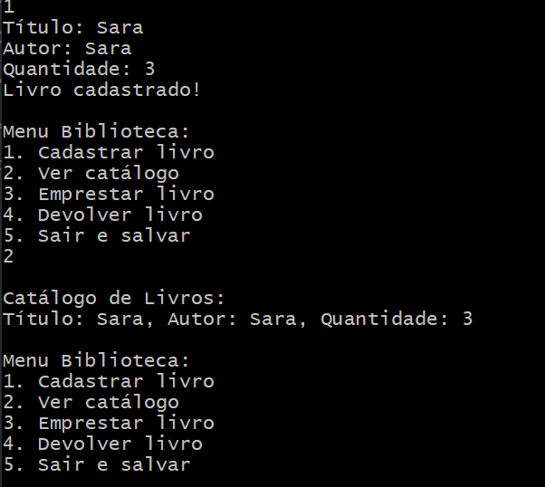
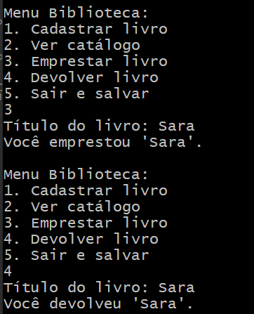

# GerenciamentoBiblioteca

## O que foi utilizado:

- ***Linguagem de programação:*** C#

- ***Ambiente de desenvolvimento:*** Virtual Studio Code

## Etapas implementadas:

***1. Carregar catálogo:*** O sistema verifica se o arquivo de catálogo existe e carrega as informações dos livros nele.

***2. Menu interativo:*** Um menu em loop permite ao usuário escolher entre cadastrar livros, visualizar o catálogo, emprestar ou devolver livros, e salvar o catálogo.

***3. Cadastro de livros:*** Permite ao usuário adicionar novos livros ao catálogo.

***4. Exibição do catálogo:*** Mostra todos os livros disponíveis com suas quantidades.

## Backlog (Possíveis melhorias): 

***Validação de entrada:*** Implementar validações robustas, como verificar se o valor inserido é um número válido para quantidade.

***Busca por título parcial:*** Permitir que o usuário possa buscar um livro com parte do título, tornando a busca mais flexível.

***Histórico de empréstimos:*** Implementar um sistema para registrar quem emprestou qual livro e quando, facilitando o controle de empréstimos.

## Conclusão:

O código atual implementa um sistema básico de gestão de biblioteca, permitindo cadastrar, visualizar, emprestar e devolver livros. Além disso, permite salvar e carregar o catálogo em um arquivo de texto, tornando a persistência de dados simples e eficiente. 
